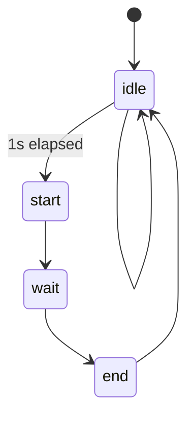

### Soil-humidity measurement

- Every 1000ms soil humidity measurement **starts** and takes a predefined amount of time (100ms initially)
- At the start of the measurement, the **counter** is cleared, and the 555 timer supplied with power
- The 555 timer keeps incrementing the counter until after 100ms it is shut down, the counter value read and the frequency calculated from the elapsed time

Here's a state machine describing the process:

How to calculate frequency from counter value and elapsed time in ticks:

- 1 second is APP_TIMER_TICKS(1000)

- in elapsed_time ... N counts

- in APP_TIMER_TICKS(1000) ... x
  $$
  x = \frac{APP\_TIMER\_TICKS(1000) * N}{elapsed\ time}
  $$
  